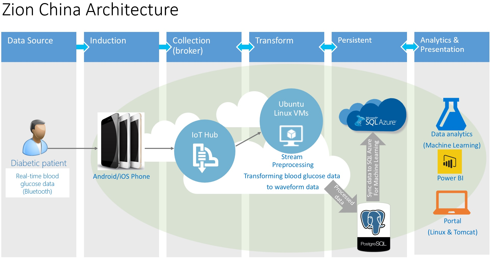

## ZionChina, Intelligent Diabetes Management with Azure IoT and Machine Learning ##

 
## Customer ##

Zion China Technology Co., Ltd. (Beijing) （www.zionchina.com）is a mobile internet healthcare company that believes that innovative technology can have a profound impact on the health and well-being of its users. It is focused on building products that improve the quality of life of patients with chronic diseases by helping them better manage their illnesses on a daily basis.
 
ZionChina created the E-Followup glucose metabolism dynamics management cloud platform. ZionChina proposes a new five-wheeled motor vehicle for diabetes management，including glucose metabolism, pharmacokinetics, dietary dynamics, exercise kinetics, and patient self-motivation. The management approach filled the gaps in the field of precision medical management in China, and pioneered the field of precision diabetes management precedent.

 
## Pain point ##

Zion China Technology Ltd. provide E-Followup Dynamic Management of Glucose Metabolism Solution E-Follow Up uses continuous glucose monitoring devices to collect patients' health data, including blood sugar, diet, exercise, medication, etc, and provide personized advices and prescription to help patients on medicine, diet and exercise.  

Their main technical and business pain points are:

1. Smart, fast and cost effective way to continuously feed data from devices to Cloud 
1. Optimize the analytic suite, moving from BI analysis to proactive predication. 
1. Persist data storage for future using with data security ensured
1. Get insight from data easier

1) Smart, fast and cost effective way to continuously feed data from devices to Cloud.

ZionChina provide services of 7-days glucose metabolism test report services and 3 months of glycated hemoglobin strengthen management services. Users wear dynamic glucose device to collect a blood glucose data in every 3 minutes, access to blood glucose changes for 7 days. At the same time collect the user's daily diet, exercise, medication, insulin and other information. ZionChina through the analysis of the data, to identify the impact of various factors for each user, to assess the current state of the user's sugar control and the risk of hidden high blood glucose, low blood glucose. At the same time, according to the user's diet preferences, to provide personalized life recommendations. 

During the wearing period, each user will generate more than 3000 blood glucose data, once every 3 minutes. High-frequency data transmission and large amounts of data storage has become a major technical problem. 

2)	Optimize the analytic suite, moving from BI analysis to proactive predication 

In the past, even with our data analytic product, each data analysis requires professional doctors to spend more than 4 hours. It takes a long time to find the correlation between the data, and it needs a lot of accumulation to find out the effective conclusion. 

3)	Persist data storage for future using with data security ensured

We need to ensure all the persist stored data, even all personal information has been removed, be stored in secure manner.

4)	Get insights from data easier

Users and doctors need to view data in many different scenarios, such as Web pages, mobile App, Pad, etc. We need a tool that can be adapted to multiple devices and is easy to develop and proficient in data analysis and presentation.

 
## Solution ##

ZionChina’s original technical solution was mostly based on traditional BI with data sourced from on premise and varies devices or Cloud storage. 

Microsoft DX China team worked with ZionChina to re-architect the solution:

- Adding IoT Hub to front-end to serve real time data transmission from device to Cloud
- Using Azure Machine Learning to generate proactive predication on glucose and patient’s data. 
- Using Azure SQL DB’s Transparent Data Encryption to secure data
- Using PowerBI and PowerBI embedded for easier insights visualization 

Key Microsoft technologies:
 
- Azure IoT Hub
- Stream Analytics
- Azure SQL Database
- Machine Learning
- Power BI

 

##Architecture##

This is the architecture of ZionChina Solution.

##Device used & Code artifacts

Below are the key technical components with code artifacts

**IoT SDK Integration**

Using Microsoft Azure IoT Hub to real time transfer data to Cloud.

    

##Opportunities going forward

This section is optional, but if you have details on how the customer plans to proceed or what more they hope to accomplish, please include.

##Conclusion##

