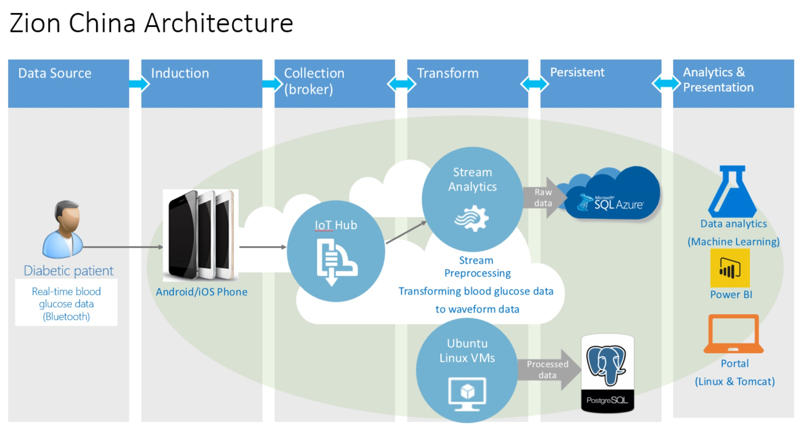

---
layout: post
title:  "Continuous Delivery with Amadeus"
author: "David Tesar"
author-link: "#"
#author-image: "{{ site.baseurl }}/images/authors/photo.jpg"
date:   2016-04-05 20:13:28
categories: DevOps
color: "blue"
#image: "{{ site.baseurl }}/images/Amadeus-Logo.png" #should be ~350px tall
excerpt: Microsoft teamed up with Amadeus in November 2015 to help them begin a DevOps journey, assess where they could make improvements with the most impact, and implement recommendations to better deliver value to their customers.
verticals: Retail, Consumer Products & Services
language: English
---

## ZionChina, Intelligent Diabetes Management with Azure IoT and Machine Learning ##

 
## Customer ##
Who are they?

What do they do?

 
## Pain point ##

Paragraph on the business pain point they were experiencing. Include things like costs, customer experience, etc.

 
## Solution ##

IoT proposed solution will do X and help with the pain points above by Y.

Future potential to their business and operations.

##Architecture##

This is the architecture of ZionChina Solution.

##Device used & Code artifacts

##Opportunities going forward

This section is optional, but if you have details on how the customer plans to proceed or what more they hope to accomplish, please include.

##Conclusion##

